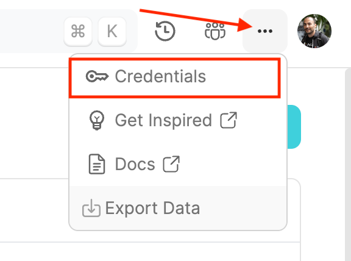
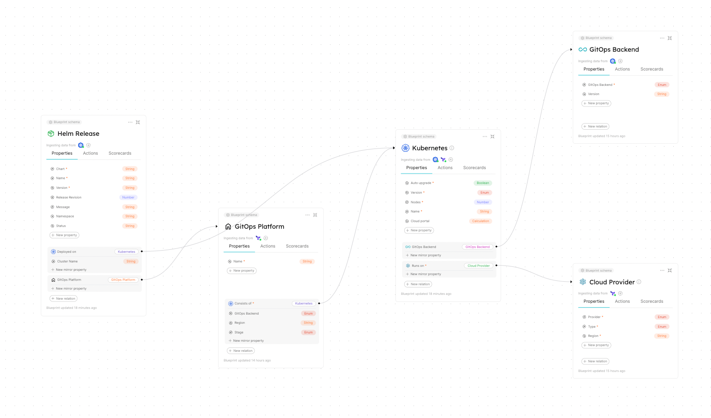
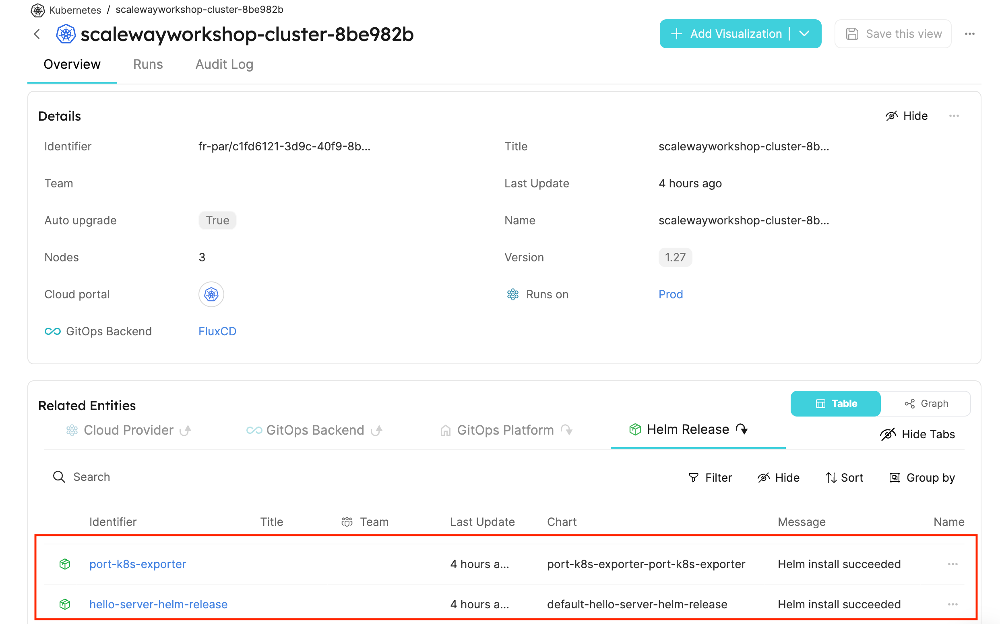
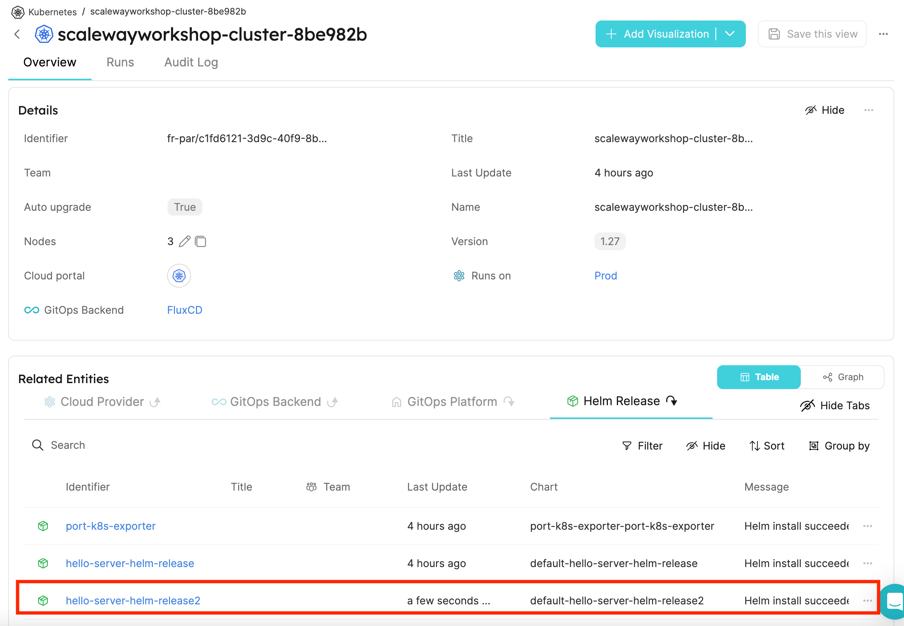

# Chapter 4 - Build an internal developer platform with Port

## Overview

In this chapter, we are going to have a short glimpse in the creation of an internal developer platform
using [Port](https://getport.io). Port is a platform which allows as to model your service catalog, create self-service
capabilities and add scorecards to your services.

With Port, you can easily implement different use cases, like:

- Microservice catalog
- IaC self-service for Developers
- Ephemeral environments
- ... and many more

It is definitely worth to have a look at Port and try it out after the workshop as we only scratch the surface of what
Port can do.

## Prerequisites

- The Kubernetes cluster from the [previous chapter](/03-fluxcd-setup.md)
- Pulumi CLI installed
- [Go](https://golang.org/doc/install)
- A free Port account (https://getport.io)

## Instructions

### Step 1 - Change into the `04-idp` directory

```bash
cd 04-idp
# Install go dependencies
go mod download
```

## Step 2 - Get the Kubernetes cluster outputs

To retrieve the output from our cluster deployment, we use `StackReference`. Please change the actual stack names to the
ones you used in the previous chapters.

```bash
pulumi config set infraStackRef
```

Pulumi will ask you now to create a new stack. You can name the stack whatever you want. If you run Pulumi with the
local login, please make sure to use for every stack a different name.

```bash
Please choose a stack, or create a new one:  [Use arrows to move, type to filter]
> <create a new stack>
Please choose a stack, or create a new one: <create a new stack>
Please enter your desired stack name: deploy   
```

### Step 3 - Set the Port client ID and secret as environment variables

To authenticate against the Port API, we need to set the client ID and secret as environment variables. You can find the
credentials in the Port UI next to your profile picture.


<br>


Copy the client ID and secret and set them as environment variables.

```bash
export PORT_CLIENT_ID=<your client id>
export PORT_CLIENT_SECRET=<your client secret>
```

### Step 3 - Deploy the stack

> **Note:** If you run Pulumi for the first time, you will be asked to log in. Follow the instructions on the screen to
> login. You may need to create an account first, don't worry it is free.
> Alternatively you can use also the `pulumi login --local` command to login locally.

Change in the `Pulumi.yaml` the `gitrepo` section to match your forked repository.

Run `pulumi up` to deploy the stack.

```bash
pulumi up
```

The Pulumi program, defines all the necessary Port Blueprints, Entities and deploys the Port k8s-exporter via FluxCD.

After the stack is deployed, you should see in the [Port UI](https://app.getport.io/dev-portal) following blueprint
relationship model:



Currently, we have only blueprints and entities defined but not self-service capabilities. This by far out of scope of
this workshop, but you can find more information about self-service capabilities in the Port documentation.

### Step 4 - Add a new Helm release

Before we add a new Helm release, let's have a look at the current deployed Helm releases using the Port UI.



We can see that we have two Helm release deployed, on is the `hello-server-helm-release` and the other one is
the `port-k8s-exporter`. So far so good, but how can we add a new Helm release?

In [Step 3](/03-fluxcd-setup.md), we deployed one `hello-server-helm-release` via FluxCD. Now to keep things simple,
just add a new Helm release by copying the `hello-server-helm-release` and change the name
to `hello-server-helm-release-2`.

```go
package main

func main() {
	// ...
	// Add the new release
	_, err = apiextensions.NewCustomResource(ctx, "hello-server-helm-release2", &apiextensions.CustomResourceArgs{
		ApiVersion: pulumi.String("helm.toolkit.fluxcd.io/v2beta1"),
		Kind:       pulumi.String("HelmRelease"),
		Metadata: &metav1.ObjectMetaArgs{
			Name: pulumi.String("hello-server-helm-release2"),
		},
		OtherFields: kubernetes.UntypedArgs{
			"spec": pulumi.Map{
				"interval": pulumi.String("1m"),
				"chart": pulumi.Map{
					"spec": pulumi.Map{
						"chart":    pulumi.String("./delivery/charts/hello-server"),
						"interval": pulumi.String("1m"),
						"sourceRef": pulumi.Map{
							"kind": gitRepo.Kind,
							"name": gitRepo.Metadata.Name(),
						},
					},
				},
			},
		},
	}, pulumi.Provider(k8sProvider), pulumi.DependsOn([]pulumi.Resource{release, gitRepo}))
	if err != nil {
		return err
	}
	// ...
}
```

Deploy the stack again with `pulumi up`.

```bash
cd ..
cd 03-fluxcd-setup
pulumi up
```

After the stack is deployed, you should see in the [Port UI](https://app.getport.io/dev-portal) a new Helm release
entity called `hello-server-helm-release-2`.



## Stretch Goals

- Can you add the `kubeconfig` as property to the Kubernetes cluster blueprint and assign the real value to the cluster
  entity?

## Learn More

- [Port](https://getport.io)
- [Pulumi](https://www.pulumi.com/)
- [Kubernetes Pulumi Provider](https://www.pulumi.com/registry/packages/kubernetes/)
- [FluxCD](https://fluxcd.io/flux/)
