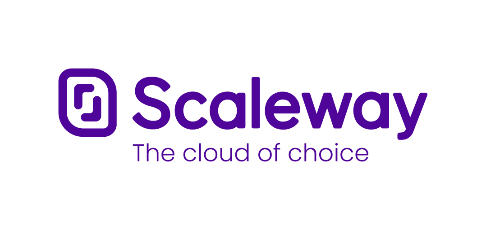

# Pulumi: Production Ready Kubernetes Workshop

## Welcome, Kubernetes Friends! 👋

The goal of this workshop is for you to bootstrap a production ready Kubernetes Cluster. Every lab of the workshops
uses Pulumi. From creating the infrastructure to setting up the GitOps Pipeline with FluxCD.

### Content

- [Chapter 0 - Create a Kubernetes Cluster](./00-cluster-setup.md)
- [Chapter 1 - Containerize an Application](./01-app-setup.md)
- [Chapter 2 - Deploy the Application to Kubernetes](./02-deploy-app.md)
- [Chapter 3 - Setup FluxCD](./03-fluxcd-setup.md)
- [Chapter 4 - Build an internal developer platform with Port](./04-idp-port.md)
- [Chapter 5 - Destroy the Kubernetes Custer](./05-cluster-teardown.md)

### Prerequisites

You will need to install these tools in order to complete this workshop:

- [Pulumi](https://www.pulumi.com/docs/get-started/install/)
- [Pulumi Account](https://app.pulumi.com/signup) - this optional, but convenient to handle the state of the different
  stacks.
- [node.js](https://nodejs.org/en/download/)
- [Go](https://golang.org/doc/install)
- [Scaleway CLI](https://www.scaleway.com/en/cli/)
- [Docker](https://docs.docker.com/get-docker/)
- [kubectl](https://kubernetes.io/docs/tasks/tools/)
- [A GitHub Account](https://github.com/signup)
- [Helm](https://helm.sh/docs/intro/install/)
- [FluxCD](https://fluxcd.io/docs/installation/)

There is also a [devcontainer.json](.devcontainer/devcontainer.json) file in this repository which you can use to spin
up a `devcontainer` with all the tools installed. Highly recommended if you are using [VSCode](https://code.visualstudio.com/docs/devcontainers/containers), [GitHub Codespaces](https://docs.github.com/en/codespaces/overview) or
[DevPods](https://devpod.sh).

### Cloud provider

This workshop uses [Scaleway](https://www.scaleway.com/en/) as cloud provider. If you don't have an account yet, you can
create one [here](https://console.scaleway.com/register).

### Troubleshooting Tips

If you get stuck during the workshops, you can try the following things in order:

1. You can reach out for me anytime! Happy to help you on track again.
1. Google the error! Honestly you will learn the most with this way.
1. Reach out the community in the Pulumi Community Slack. You can join the Slack [here](https://slack.pulumi.com/).

### Want to know more?

If you enjoyed this workshop, please some of Pulumi's other [learning materials](https://www.pulumi.com/learn/)

